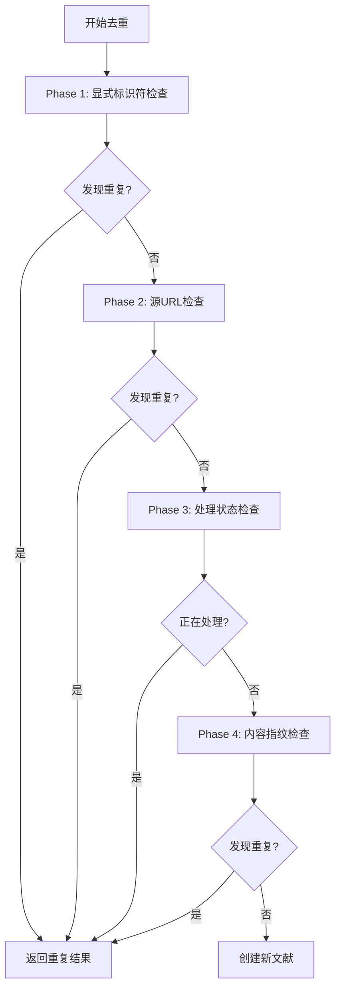

# 业务逻辑去重系统详细指南

## 📋 概述

本文档详细介绍文献解析系统的业务逻辑去重功能。该系统采用完全业务逻辑去重的方案，移除了数据库层面的唯一约束，通过智能的瀑布流去重策略确保数据一致性。

## 🎯 设计理念

### 核心原则

1. **异步优先**: API立即响应，所有复杂逻辑在后台执行
2. **业务逻辑控制**: 完全依赖业务代码进行去重，不依赖数据库约束
3. **瀑布流策略**: 多层次、多维度的去重检查
4. **并发安全**: 正确处理高并发场景下的竞态条件

### 优势对比

| 方面 | 数据库约束去重 | 业务逻辑去重 |
|------|----------------|--------------|
| **性能** | 写入时可能阻塞 | 高并发友好 |
| **灵活性** | 约束固定 | 可动态调整策略 |
| **错误处理** | 抛出异常 | 优雅降级 |
| **复杂场景** | 难以处理 | 支持复杂逻辑 |
| **维护性** | 数据库依赖 | 代码可控 |

## 🌊 瀑布流去重策略

### 四阶段去重流程



### Phase 1: 显式标识符去重

**检查对象**: DOI, ArXiv ID, PMID等权威标识符

**实现位置**: `worker/deduplication.py` - `_check_explicit_identifiers()`

**逻辑**:
```python
async def _check_explicit_identifiers(self, source_data: Dict[str, Any]) -> Optional[str]:
    identifiers, _ = extract_authoritative_identifiers(source_data)
    
    # DOI检查
    if identifiers.doi:
        literature = await self.dao.find_by_doi(identifiers.doi)
        if literature:
            return self._handle_existing_literature(literature)
    
    # ArXiv ID检查
    if identifiers.arxiv_id:
        literature = await self.dao.find_by_arxiv_id(identifiers.arxiv_id)
        if literature:
            return self._handle_existing_literature(literature)
    
    return None
```

### Phase 2: 源URL去重

**检查对象**: 各种形式的源URL

**实现位置**: `worker/deduplication.py` - `_check_source_urls()`

**支持的URL类型**:
- ArXiv URL (`https://arxiv.org/abs/...`)
- DOI URL (`https://doi.org/...`)
- 期刊页面URL
- PDF直链

### Phase 3: 处理状态检查

**目的**: 防止并发处理同一文献

**实现位置**: `worker/deduplication.py` - `_check_processing_state()`

**检查逻辑**:
- 查找状态为 `pending`, `processing`, `in_progress` 的文献
- 基于DOI、ArXiv ID等标识符匹配

### Phase 4: 内容指纹去重

**检查对象**: PDF内容MD5、标题+作者指纹

**实现位置**: `worker/deduplication.py` - `_check_content_fingerprint()`

**特点**:
- 需要先下载和解析PDF
- 生成多种指纹进行匹配
- 支持模糊匹配

## 🏗️ 系统架构

### 核心组件

| 组件 | 文件路径 | 主要功能 |
|------|----------|----------|
| **WaterfallDeduplicator** | `worker/deduplication.py` | 瀑布流去重核心逻辑 |
| **LiteratureDAO** | `db/dao.py` | 数据库查询操作 |
| **任务编排** | `worker/tasks.py` | 去重流程集成 |
| **API层** | `web/api/literature.py` | 异步任务创建 |

### 数据库索引设计

**优化前** (存在唯一约束问题):
```javascript
doi_unique_index: {"identifiers.doi": 1} [UNIQUE] [PARTIAL]
arxiv_unique_index: {"identifiers.arxiv_id": 1} [UNIQUE] [PARTIAL]
fingerprint_unique_index: {"identifiers.fingerprint": 1} [UNIQUE] [PARTIAL]
```

**优化后** (纯查询索引):
```javascript
// 核心查询索引 (无唯一约束)
doi_query_index: {"identifiers.doi": 1} [PARTIAL]
arxiv_query_index: {"identifiers.arxiv_id": 1} [PARTIAL]
fingerprint_query_index: {"identifiers.fingerprint": 1} [PARTIAL]
task_id_query_index: {"task_info.task_id": 1}
title_text_search_index: {"metadata.title": "text"}
```

## 🔧 配置和部署

### 索引优化脚本

```bash
# 移除唯一约束，创建查询索引
python scripts/optimize_business_logic_indexes.py

# 简化索引结构，只保留核心索引
python scripts/simplify_index_structure.py
```

### 环境变量

无需额外配置，使用现有的数据库和Redis配置即可。

## 🧪 测试验证

### 自动化测试

```bash
# 运行完整的去重测试
python3 test_business_logic_deduplication.py
```

**测试覆盖**:
- ✅ DOI去重测试
- ✅ ArXiv ID去重测试  
- ✅ 并发提交测试
- ✅ 跨标识符去重测试

### 测试结果示例

```
🚀 开始业务逻辑去重全面测试...
============================================================

🔬 测试DOI去重...
✅ DOI去重: PASS
   成功检测到DOI重复

🔬 测试ArXiv ID去重...
✅ ArXiv去重: PASS
   成功检测到ArXiv重复

🔬 测试并发提交...
✅ 并发提交: PASS
   正确处理并发: 1个创建, 2个重复

🔬 测试跨标识符去重...
✅ 跨标识符去重: PASS
   成功检测到跨标识符重复 (DOI vs ArXiv)

============================================================
📊 测试结果统计:
✅ 通过: 4
❌ 失败: 0
⚠️  警告: 0
📈 总计: 4

🎉 所有核心测试通过！业务逻辑去重工作正常！
```

## 📊 性能监控

### 关键指标

1. **去重准确率**: 应接近100%
2. **响应时间**: API响应 < 100ms
3. **处理时间**: 后台去重 < 30s
4. **并发处理**: 支持高并发提交

### 监控方法

```python
# 在代码中添加监控点
import time
from loguru import logger

async def deduplicate_literature(self, source_data):
    start_time = time.time()
    
    # 执行去重逻辑
    result = await self._execute_deduplication(source_data)
    
    # 记录性能指标
    duration = time.time() - start_time
    logger.info(f"去重完成: 耗时{duration:.2f}s, 结果: {result}")
    
    return result
```

## 🔍 故障排除

### 常见问题

1. **重复文献未被检测到**
   - 检查标识符提取逻辑
   - 验证数据库索引状态
   - 查看去重日志

2. **并发处理异常**
   - 检查Redis连接状态
   - 验证任务队列配置
   - 查看Worker日志

3. **性能问题**
   - 检查数据库索引效率
   - 监控查询执行时间
   - 优化去重策略

### 调试工具

```bash
# 查看去重详细日志
docker logs paper_paser_1-worker-1 | grep "deduplication"

# 检查数据库索引状态
python scripts/check_index_status.py

# 手动测试去重逻辑
python -c "
from literature_parser_backend.worker.deduplication import WaterfallDeduplicator
# 测试代码...
"
```

## 🚀 最佳实践

### 开发建议

1. **扩展去重策略**
   ```python
   # 在WaterfallDeduplicator中添加新的检查阶段
   async def _check_custom_logic(self, source_data):
       # 自定义去重逻辑
       pass
   ```

2. **性能优化**
   - 缓存常用查询结果
   - 批量处理相似请求
   - 异步并行检查

3. **监控集成**
   - 添加Prometheus指标
   - 集成APM工具
   - 设置告警规则

### 运维建议

1. **定期维护**
   ```bash
   # 清理失败的文献记录
   python scripts/cleanup_failed_literature.py
   
   # 重建索引
   python scripts/rebuild_indexes.py
   ```

2. **备份策略**
   - 定期备份MongoDB数据
   - 保留去重日志
   - 监控存储使用量

## 📈 未来扩展

### 计划功能

1. **智能去重**
   - 基于机器学习的相似度检测
   - 语义相似性分析
   - 自动合并重复文献

2. **性能优化**
   - 分布式去重缓存
   - 预计算指纹索引
   - 实时去重建议

3. **管理功能**
   - 去重规则配置界面
   - 重复文献管理工具
   - 去重统计报表

### 扩展接口

```python
class DeduplicationStrategy:
    """去重策略接口"""
    
    async def check_duplicate(self, source_data: Dict) -> Optional[str]:
        """检查是否重复"""
        raise NotImplementedError
    
    def get_priority(self) -> int:
        """获取策略优先级"""
        return 0

# 注册自定义策略
deduplicator.register_strategy(CustomStrategy())
```
