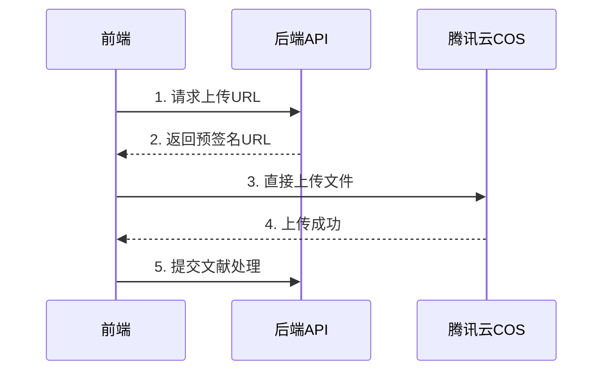

# 腾讯云COS文件上传API使用指南

## 📋 概述

本文档详细介绍如何使用文献解析系统的腾讯云COS文件上传功能。该功能采用现代化的前端直传方案，通过预签名URL实现安全、高效的PDF文件上传。

## 🚀 快速开始

### 1. 环境配置

在 `.env` 文件中配置腾讯云COS参数：

```bash
# 腾讯云COS配置
LITERATURE_PARSER_BACKEND_COS_SECRET_ID=your_secret_id_here
LITERATURE_PARSER_BACKEND_COS_SECRET_KEY=your_secret_key_here
LITERATURE_PARSER_BACKEND_COS_REGION=ap-shanghai
LITERATURE_PARSER_BACKEND_COS_BUCKET=paperparser-1330571283
LITERATURE_PARSER_BACKEND_COS_DOMAIN=paperparser-1330571283.cos.ap-shanghai.myqcloud.com

# 文件上传限制
LITERATURE_PARSER_BACKEND_UPLOAD_MAX_FILE_SIZE=52428800  # 50MB
LITERATURE_PARSER_BACKEND_UPLOAD_PRESIGNED_URL_EXPIRES=3600  # 1小时
```

### 2. 基本使用流程



## 📡 API端点详解

### 1. 请求预签名上传URL

**端点**: `POST /api/upload/request-url`

**请求体**:
```json
{
  "fileName": "research_paper.pdf",
  "contentType": "application/pdf",
  "fileSize": 2048576,
  "userId": "user123"
}
```

**响应**:
```json
{
  "uploadUrl": "https://paperparser-1330571283.cos.ap-shanghai.myqcloud.com/uploads/user123/2025/01/22/uuid.pdf?sign=xxx",
  "publicUrl": "https://paperparser-1330571283.cos.ap-shanghai.myqcloud.com/uploads/user123/2025/01/22/uuid.pdf",
  "objectKey": "uploads/user123/2025/01/22/uuid.pdf",
  "expires": 3600,
  "maxFileSize": 52428800
}
```

### 2. 查询文件上传状态

**端点**: `GET /api/upload/status`

**查询参数**:
- `public_url`: 文件的公开访问URL
- `object_key`: 对象存储键名（二选一）

**响应**:
```json
{
  "objectKey": "uploads/user123/2025/01/22/uuid.pdf",
  "exists": true,
  "size": 2048576,
  "contentType": "application/pdf",
  "lastModified": "2025-01-22T10:30:00Z",
  "publicUrl": "https://paperparser-1330571283.cos.ap-shanghai.myqcloud.com/uploads/user123/2025/01/22/uuid.pdf"
}
```

### 3. 删除上传的文件

**端点**: `DELETE /api/upload/file`

**查询参数**:
- `public_url`: 文件的公开访问URL
- `object_key`: 对象存储键名（二选一）

**响应**:
```json
{
  "message": "文件删除成功",
  "objectKey": "uploads/user123/2025/01/22/uuid.pdf"
}
```

## 💻 前端集成示例

### JavaScript/TypeScript

```javascript
class COSUploader {
  constructor(baseUrl = '/api') {
    this.baseUrl = baseUrl;
  }

  async uploadFile(file, userId = null) {
    try {
      // 1. 请求预签名URL
      const urlResponse = await fetch(`${this.baseUrl}/upload/request-url`, {
        method: 'POST',
        headers: { 'Content-Type': 'application/json' },
        body: JSON.stringify({
          fileName: file.name,
          contentType: file.type || 'application/pdf',
          fileSize: file.size,
          userId: userId
        })
      });

      if (!urlResponse.ok) {
        throw new Error(`获取上传URL失败: ${urlResponse.status}`);
      }

      const { uploadUrl, publicUrl } = await urlResponse.json();

      // 2. 直接上传到COS
      const uploadResponse = await fetch(uploadUrl, {
        method: 'PUT',
        body: file,
        headers: {
          'Content-Type': file.type || 'application/pdf'
        }
      });

      if (!uploadResponse.ok) {
        throw new Error(`文件上传失败: ${uploadResponse.status}`);
      }

      // 3. 验证上传状态
      const statusResponse = await fetch(
        `${this.baseUrl}/upload/status?public_url=${encodeURIComponent(publicUrl)}`
      );

      if (statusResponse.ok) {
        const status = await statusResponse.json();
        if (status.exists) {
          return { success: true, publicUrl, fileInfo: status };
        }
      }

      throw new Error('文件上传验证失败');

    } catch (error) {
      console.error('上传失败:', error);
      return { success: false, error: error.message };
    }
  }

  async submitLiterature(publicUrl, additionalData = {}) {
    try {
      const response = await fetch(`${this.baseUrl}/literature`, {
        method: 'POST',
        headers: { 'Content-Type': 'application/json' },
        body: JSON.stringify({
          pdf_url: publicUrl,
          ...additionalData
        })
      });

      if (!response.ok) {
        throw new Error(`提交文献失败: ${response.status}`);
      }

      const result = await response.json();
      return { success: true, taskId: result.task_id };

    } catch (error) {
      console.error('提交文献失败:', error);
      return { success: false, error: error.message };
    }
  }
}

// 使用示例
const uploader = new COSUploader();

document.getElementById('fileInput').addEventListener('change', async (event) => {
  const file = event.target.files[0];
  if (!file) return;

  console.log('开始上传文件...');
  const uploadResult = await uploader.uploadFile(file, 'user123');

  if (uploadResult.success) {
    console.log('文件上传成功:', uploadResult.publicUrl);
    
    // 提交文献处理
    const submitResult = await uploader.submitLiterature(uploadResult.publicUrl, {
      title: '用户上传的文献'
    });

    if (submitResult.success) {
      console.log('文献处理任务已创建:', submitResult.taskId);
    }
  } else {
    console.error('上传失败:', uploadResult.error);
  }
});
```

### React Hook示例

```jsx
import { useState, useCallback } from 'react';

export const useFileUpload = (baseUrl = '/api') => {
  const [uploading, setUploading] = useState(false);
  const [progress, setProgress] = useState(0);

  const uploadFile = useCallback(async (file, userId = null) => {
    setUploading(true);
    setProgress(0);

    try {
      // 请求预签名URL
      setProgress(10);
      const urlResponse = await fetch(`${baseUrl}/upload/request-url`, {
        method: 'POST',
        headers: { 'Content-Type': 'application/json' },
        body: JSON.stringify({
          fileName: file.name,
          contentType: file.type || 'application/pdf',
          fileSize: file.size,
          userId: userId
        })
      });

      const { uploadUrl, publicUrl } = await urlResponse.json();

      // 上传文件
      setProgress(50);
      const uploadResponse = await fetch(uploadUrl, {
        method: 'PUT',
        body: file,
        headers: { 'Content-Type': file.type || 'application/pdf' }
      });

      if (!uploadResponse.ok) {
        throw new Error('上传失败');
      }

      setProgress(100);
      return { success: true, publicUrl };

    } catch (error) {
      return { success: false, error: error.message };
    } finally {
      setUploading(false);
    }
  }, [baseUrl]);

  return { uploadFile, uploading, progress };
};
```

## 🔒 安全特性

### 文件验证

系统会对上传的文件进行多层验证：

1. **文件名安全检查**
   - 禁止路径遍历字符 (`../`, `\`)
   - 禁止危险字符 (`<>:"|?*`)
   - 禁止Windows保留名称 (`CON`, `PRN`, `AUX`)

2. **文件大小限制**
   - 默认最大50MB
   - 可通过环境变量配置

3. **文件类型验证**
   - 只允许PDF文件 (`.pdf`)
   - 验证MIME类型

4. **PDF内容验证**
   - 检查PDF魔数 (`%PDF-`)
   - 基本结构完整性检查

### URL安全

1. **预签名URL限制**
   - 默认1小时过期
   - 只能用于指定文件上传

2. **防SSRF攻击**
   - 禁止访问私有IP地址
   - 禁止访问本地地址

## ⚠️ 错误处理

### 常见错误码

| 状态码 | 错误类型 | 说明 |
|--------|----------|------|
| 400 | ValidationError | 请求参数验证失败 |
| 413 | FileTooLarge | 文件大小超过限制 |
| 415 | UnsupportedMediaType | 不支持的文件类型 |
| 500 | InternalError | 服务器内部错误 |

### 错误响应格式

```json
{
  "error": "ValidationError",
  "message": "文件大小超过限制",
  "details": {
    "maxSize": "50MB",
    "actualSize": "75MB"
  }
}
```

## 🧪 测试

### 运行集成测试

```bash
# 完整的端到端测试
python3 test_cos_upload_integration.py

# 只测试安全验证
python3 -c "
from test_cos_upload_integration import COSUploadIntegrationTester
tester = COSUploadIntegrationTester()
tester.test_security_validation()
"
```

### 手动测试

```bash
# 测试请求上传URL
curl -X POST http://localhost:8000/api/upload/request-url \
  -H "Content-Type: application/json" \
  -d '{
    "fileName": "test.pdf",
    "contentType": "application/pdf",
    "fileSize": 1024
  }'

# 测试文件状态查询
curl "http://localhost:8000/api/upload/status?public_url=https://example.com/file.pdf"
```

## 📈 性能优化建议

1. **前端优化**
   - 使用文件分片上传（大文件）
   - 实现上传进度显示
   - 添加断点续传功能

2. **后端优化**
   - 启用COS CDN加速
   - 配置合适的CORS策略
   - 设置生命周期规则清理临时文件

3. **监控建议**
   - 监控上传成功率
   - 跟踪文件大小分布
   - 监控COS存储使用量

## 🔧 故障排除

### 常见问题

1. **上传失败**
   - 检查COS配置是否正确
   - 验证预签名URL是否过期
   - 确认文件大小和类型符合要求

2. **文件无法访问**
   - 检查存储桶权限设置
   - 验证公开URL格式
   - 确认文件确实已上传

3. **性能问题**
   - 启用CDN加速
   - 检查网络连接质量
   - 考虑使用就近的COS区域
