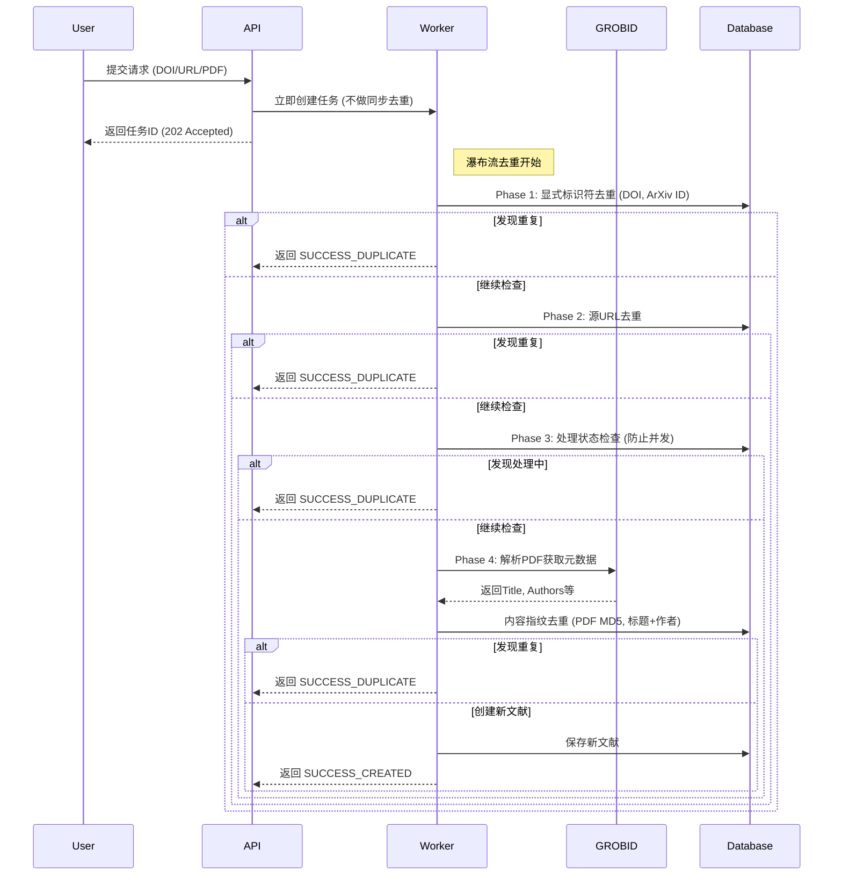
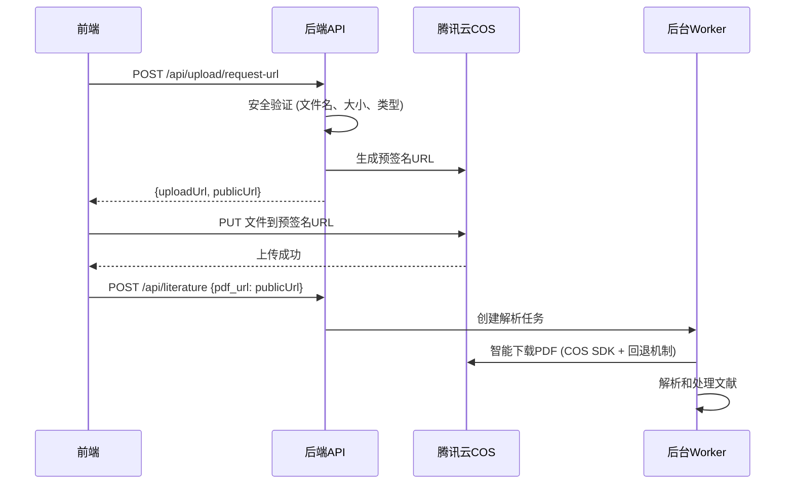

# 文献解析系统 - 后端架构设计说明

**版本**: 1.0
**日期**: 2025年7月14日

## 1\. 概述

### 1.1. 项目目标

本文档旨在为“文献解析与管理系统”设计一个功能强大、可扩展且易于维护的后端服务。该后端的核心目标是能够智能、自动化地从多种来源（如URL、DOI、PDF文件）获取文献信息，提取并结构化其元数据（Metadata）和参考文献（References），为前端应用提供稳定、高效的数据支持。

### 1.2. 设计哲学

本架构遵循以下核心设计哲学：

  * **数据为中心 (Data-Centric)**：以清晰的数据模型（元数据、内容、引用）为核心，驱动所有业务流程。
  * **异步长任务处理 (Asynchronous Processing)**：对于PDF解析等耗时操作，采用任务队列进行异步处理，确保API的快速响应和优质的用户体验。
  * **封装复杂性 (Encapsulated Complexity)**：为前端提供统一、简洁的API入口，将复杂的内部处理逻辑（如多源获取、优先级判断、失败回退）对前端完全透明。
  * **专业工具组合 (Best-of-Breed Tooling)**：为系统的每个部分（Web服务、数据库、缓存、任务队列、PDF解析）选择最适合、最专业的开源工具，组合成一个强大的技术栈。

-----

## 2\. 技术栈选型

| 类别                | 技术/工具                                | 角色与说明                                                |
| :------------------ | :--------------------------------------- | :-------------------------------------------------------- |
| **语言**            | Python 3.11+                             | 主力开发语言，拥有强大的数据处理生态。                    |
| **Web框架**         | FastAPI                                  | 高性能Web框架，自带数据校验和交互式API文档。              |
| **主数据库**        | MongoDB                                  | 文档数据库，非常适合存储结构灵活的文献JSON数据。          |
| **任务队列**        | Celery                                   | 分布式任务队列，用于处理所有耗时的后台任务。              |
| **消息中间人/缓存** | Redis                                    | 高性能内存数据库，用作Celery的Broker和应用层缓存。        |
| **PDF解析服务**     | GROBID (v0.8.0+)                         | 独立的Java服务（通过Docker运行），提供顶级的PDF解析能力。 |
| **对象存储**        | 腾讯云COS                                 | 云对象存储服务，用于高效、安全的文件上传和存储。          |
| **项目起点**        | `tiangolo/full-stack-fastapi-postgresql` | 一个生产级的项目模板，我们将基于它进行开发和改造。        |

-----

## 3\. 系统架构

本系统采用微服务和异步任务队列的设计思想，将实时API服务与耗时的数据处理任务分离。

### 3.1. 架构图
```mermaid
graph TD
    subgraph "用户端 (Client)"
        A[Next.js 前端应用]
    end

    subgraph "后端服务 (Python Backend)"
        B[Web服务器<br>(FastAPI)]
        C[后台工作单元<br>(Celery Worker)]
        D[任务队列<br>(Redis)]
        E[主数据库<br>(MongoDB)]
    end

    subgraph "依赖服务 (Dependencies)"
        F[GROBID 微服务<br>(Docker)]
        G[外部学术API<br>(Semantic Scholar, CrossRef)]
    end

    A -- 1. 发起API请求 (HTTP) --> B
    B -- 2. 创建任务, 放入队列 --> D
    B -- 3. 立即返回taskId --> A
    D -- 4. Worker获取任务 --> C
    C -- 5. 执行智能工作流 --> G
    C -- 6. 需要时调用GROBID --> F
    F -- 7. 返回解析结果 --> C
    C -- 8. 结果存入数据库 --> E
    A -- 9. 轮询任务状态 --> B
    B -- 10. 从数据库/Redis查询状态 --> E & D
    A -- 11. 获取最终数据 --> B
    B -- 12. 从数据库读取数据 --> E
```

### 3.2. 数据流说明

1.  **前端**通过`POST /literatures`发起一个文献处理请求。
2.  **FastAPI**接收请求，验证数据后，创建一个任务并将其推入**Redis**任务队列。
3.  **FastAPI**立刻向前端返回一个`taskId`，前端可以开始轮询任务状态。
4.  一个空闲的**Celery Worker**从**Redis**中获取该任务。
5.  **Worker**开始执行“智能混合工作流”，按优先级调用**外部学术API**获取数据。
6.  如果需要进行PDF解析，Worker会通过HTTP请求调用独立的**GROBID服务**。
7.  **GROBID**返回解析后的XML数据给Worker。
8.  Worker处理所有数据，将其整合成一个完整的文献对象，存入**MongoDB**数据库，并更新任务状态。
9.  **前端**通过轮询`GET /tasks/{taskId}`得知任务成功，并获得最终的文献ID。
10. **前端**通过`GET /literatures/{literatureId}`从**FastAPI**获取完整的文献数据，FastAPI则从**MongoDB**中读取并返回。

-----

## 4\. 核心工作流：数据获取的瀑布流策略

系统的核心是一个智能的瀑布流（Waterfall）工作流，用于填充文献数据模型的三个主要部分：`Metadata`、`Content` 和 `References`。解析流程为：1. `Metadata` 2. `References`，如果需要解析PDF，则进入`Content`获取流程，此流程旨在优先使用最高效、最可靠的数据源，并将资源密集型操作（如PDF解析）作为后备方案。

### 4.1. Metadata (元数据) 获取优先级

元数据的质量直接影响文献的可发现性和准确性。

| 优先级       | 数据源                    | 说明                                                                                                                    |
| :----------- | :------------------------ | :---------------------------------------------------------------------------------------------------------------------- |
| **1 (最高)** | **用户手动输入/修改**     | 用户在前端界面进行的任何手动修改拥有最高优先级，将直接覆盖所有自动获取的数据。                                          |
| **2**        | **权威API (通过DOI/URL)** | 使用从`source`中提取的DOI或URL，请求 **CrossRef** 或 **Semantic Scholar API**。这是获取高质量、结构化元数据的首选路径。 |
| **3**        | **PDF解析 (GROBID)**      | 如果API路径失败或无可用标识符，但已获得PDF文件，则启动 **GROBID** 解析PDF的头部信息来提取元数据。此方法作为可靠的后备。 |
| **4 (失败)** | **提示用户**              | 如果以上所有方法均失败，任务状态将更新为失败，并提示用户提供更明确的信息（如准确的DOI或PDF文件）。                      |

### 4.2. Content (PDF源文件) 获取优先级

获取PDF文件是进行深度解析（如提取参考文献）的前提。

| 优先级       | 数据源                        | 说明                                                                                                    |
| :----------- | :---------------------------- | :------------------------------------------------------------------------------------------------------ |
| **1 (最高)** | **用户直接提供**              | 接受用户通过上传或在请求中直接提供的 `pdf_url`。这包括来自本地或云存储（如OSS、Zotero云附件链接）的源。 |
| **2**        | **从源页面URL提取**           | 访问文献的着陆页（如`arxiv.org/abs/...`），从中解析出直接的PDF下载链接。                                |
| **3**        | **开放获取API (如Unpaywall)** | 使用文献的DOI，通过 **Unpaywall** 等服务查找合法的开放获取（Open Access）PDF版本。                      |
| **4 (失败)** | **提示用户**                  | 如果所有自动方法都无法找到PDF，系统将任务状态更新为"等待PDF"，提示前端引导用户手动上传。                |

### 4.3. References (参考文献) 获取优先级

获取结构化的参考文献列表对于构建知识图谱和引文网络至关重要。

| 优先级       | 数据源                           | 说明                                                                                                                                                       |
| :----------- | :------------------------------- | :--------------------------------------------------------------------------------------------------------------------------------------------------------- |
| **1 (最高)** | **权威API (如Semantic Scholar)** | 使用文献的DOI查询 **Semantic Scholar API**。该API通常能直接返回结构化、已解析的参考文献列表，是最高效的路径。                                              |
| **2**        | **PDF解析 (GROBID)**             | 如果API路径失败或返回数据不完整，则启动 **GROBID** 对已获取的PDF文件进行解析。GROBID会提取参考文献区域的原始文本 (`raw_text`)并尝试将其结构化 (`parsed`)。 |

-----

## 5\. API 接口设计 (API Specification)

**API根路径**: `/api/v1`

### 5.1. 创建文献处理任务

  * **功能**: 启动一篇新文献的解析和处理流程。
  * **Endpoint**: `POST /literatures`
  * **请求体 (Body)**:
    ```json
    {
      "source": {
        "doi": "10.xxxx/xxxxx", // 可选
        "url": "https://arxiv.org/abs/xxxx.xxxxx", // 可选
        "pdf_url": "https://my-oss.com/paper.pdf", // 可选
      }
    }
    ```
  * **成功响应**: `202 Accepted`
    ```json
    {
      "taskId": "a1b2-c3d4-e5f6-g7h8",
      "status_url": "/api/v1/tasks/a1b2-c3d4-e5f6-g7h8"
    }
    ```

### 5.2. 查询任务状态

  * **功能**: 轮询后台任务的处理进度。
  * **Endpoint**: `GET /tasks/{taskId}`
  * **成功响应**: `200 OK`
    ```json
    {
      "taskId": "a1b2-c3d4-e5f6-g7h8",
      "status": {
        "metadata": "success", // "pending", "processing", "success", "failure"
        "content": "processing", // "pending", "processing", "success", "failure"
        "references": "pending" // "pending", "processing", "success", "failure"
      },
      "stage": "正在使用GROBID解析PDF...",
      "resource_url": null // 成功时会变为 "/api/v1/literatures/lit_abc123"
    }
    ```

### 5.3. 获取单篇文献详情

  * **功能**: 获取一篇已处理完成的文献的完整数据。
  * **Endpoint**: `GET /literatures/{literatureId}`
  * **成功响应**: `200 OK`
    ```json
    {
      "id": "lit_abc123",
      "metadata": { /* ... */ },
      "content": { /* ... */ },
      "references": [ /* ... */ ]
    }
    ```

*(其他CRUD接口如 `PUT /literatures/{id}`, `DELETE /literatures/{id}`, `GET /literatures` 等遵循标准RESTful设计，此处从略)*

-----

## 6\. 数据模型 (MongoDB)

主文献集合 (`literatures`) 的文档结构示例如下：

```json
{
  "_id": ObjectId("68691f3bace2a8e94dd5543c"),
  "userId": ObjectId("..."), // 关联的用户ID
  "task_status": {
    "taskId": "a1b2-c3d4-e5f6-g7h8",
    "status": "success",
    "error_message": null
  },
  "metadata": {
    "title": "Attention Is All You Need",
    "authors": [
      {"full_name": "Ashish Vaswani", "sequence": "first"},
      {"full_name": "Noam Shazeer", "sequence": "additional"}
    ],
    "year": 2017,
    "journal": "Advances in Neural Information Processing Systems",
    "doi": "10.48550/arXiv.1706.03762",
    "abstract": "The dominant sequence transduction models are based on complex recurrent or convolutional neural networks...",
    "source_priority": ["CrossRef API", "User Input"]
  },
  "content": {
    "pdf_url": "https://my-oss.com/1706.03762.pdf",
    "source_page_url": "https://arxiv.org/abs/1706.03762"
  },
  "references": [
    {
      "raw_text": "Y. Bengio, et al. A neural probabilistic language model. JMLR, 2003.",
      "parsed": {
        "title": "A neural probabilistic language model",
        "year": 2003,
        "authors": [{"full_name": "Yoshua Bengio"}]
      },
      "source": "Semantic Scholar API"
    }
  ],
  "createdAt": ISODate("2025-07-14T14:16:05Z"),
  "updatedAt": ISODate("2025-07-14T14:16:05Z")
}
```

-----

## 7\. 部署与运维建议

  * **统一编排**: 使用 `docker-compose` 来统一管理和启动所有服务（FastAPI, Celery Worker, Redis, MongoDB, GROBID），极大地简化了本地开发环境的搭建和生产环境的部署。项目模板中已包含此最佳实践。
  * **配置管理**: 所有敏感信息和环境相关配置（如数据库密码、API密钥、GROBID服务地址）都应通过环境变量 (`.env`文件) 来管理，严禁硬编码在代码中。
  * **独立扩展**: GROBID服务是CPU密集型任务。如果未来解析量巨大，可以将其部署在单独的、具有更强CPU性能的服务器上，并启动多个实例进行负载均衡。

-----

## 8\. 总结

本架构方案整合了现代Python后端的最佳实践，通过清晰的微服务划分、强大的异步任务处理和智能的数据处理流程，为文献解析与管理系统提供了一个坚实、高效、可扩展的基础。从这个起点出发，开发团队可以更专注于实现核心业务功能，而非陷入繁琐的基础架构搭建工作。


-----
## 查重功能更新

sequenceDiagram
    participant User
    participant API
    participant Worker
    participant GROBID
    participant Database

    User->>API: 提交请求 (只含PDF URL)
    API->>Worker: 立即创建任务 (不做复杂去重)
    API-->>User: 返回任务ID (202 Accepted)
    
    Note right of Worker: 任务开始执行
    Worker->>GROBID: **步骤1: 解析PDF头部 (获取元数据)**
    GROBID-->>Worker: 返回Title, Authors等
    Worker->>Database: **步骤2: 使用解析出的元数据进行瀑布流去重**
    
    alt 文献已存在
        Database-->>Worker: 返回现有文献ID
        Worker->>Database: 更新任务状态为“重复”
        Note right of Worker: 任务提前结束
    else 文献不存在
        Database-->>Worker: 未找到
        Worker->>Worker: **步骤3: 继续执行完整的解析流程 (Metadata, Content, References)**
        Note right of Worker: 使用已解析的元数据，避免重复GROBID调用
        Worker->>Database: 保存新文献
    end


1. literature.py 文件修改的解释
我们对 literature_parser_backend/web/api/literature.py 文件的核心修改，都集中在 create_literature 这个函数上。
修改前的逻辑是“同步去重”：
当API收到一个请求时，它会立刻拿着请求中的DOI、ArXiv ID等信息去同步地查询数据库，看看文献是否已经存在。
如果存在，它就直接返回一个200 OK响应，告诉用户“文献已存在”。
如果不存在，它才会去创建一个后台任务。
这种做法的缺点是：
API响应慢：因为必须等待数据库查询完成，如果数据库慢，API就会被拖慢。
无法处理“只传PDF”的情况：如果用户只给了一个PDF，API没法在不知道其标题的情况下进行有效去重，这违背了我们支持PDF优先的目标。
修改后的逻辑是“纯异步任务创建”：
现在，create_literature 函数的职责被大大简化了，它变得非常“轻快”：
接收请求：接收用户提交的任何信息（DOI, PDF URL, Title等）。
快速验证：只做一个最基本的检查，确保用户至少提供了一种有效信息。
立即创建任务：它不再进行任何数据库查询，而是把所有信息直接打包，交给后台的Celery Worker去创建一个异步处理任务。
立刻返回响应：马上返回一个 202 Accepted 响应，并附上一个 task_id。
这样做的好处是：
API响应极快：用户几乎可以瞬间得到响应，大大提升了用户体验。
逻辑更健壮：所有复杂的、耗时的去重和处理逻辑，都交给了后台的Worker。即使去重需要下载PDF、调用GROBID，也不会阻塞API。这完美地实现了我们设计的先解析后去重的智能流程。
简单来说，这次修改就是把“在门口拦人（同步去重）”的保安，变成了“先进来再登记（异步去重）”的流程管理员，整个系统变得更加高效和强大。

-----

## 9. 业务逻辑去重系统 (2025年重大更新)

### 9.1. 设计理念

系统采用**完全业务逻辑去重**的方案，移除了数据库层面的唯一约束，通过智能的瀑布流去重策略确保数据一致性。

### 9.2. 核心特性

- **异步处理**: API立即返回任务ID，所有去重逻辑在后台执行
- **瀑布流策略**: 多层次、多维度的去重检查
- **智能解析**: 先解析元数据，再进行内容去重
- **并发安全**: 支持高并发提交，正确处理竞态条件

### 9.3. 去重流程



### 9.4. 实现结构

| 组件 | 位置 | 功能 |
|------|------|------|
| **WaterfallDeduplicator** | `worker/deduplication.py` | 核心去重逻辑实现 |
| **数据库索引** | MongoDB | 6个核心查询索引（无唯一约束） |
| **API层** | `web/api/literature.py` | 异步任务创建 |
| **Worker层** | `worker/tasks.py` | 去重流程编排 |

### 9.5. 索引优化

**移除前** (16个索引，3个唯一约束):
```
doi_unique_index: [UNIQUE] [PARTIAL]
arxiv_unique_index: [UNIQUE] [PARTIAL]
fingerprint_unique_index: [UNIQUE] [PARTIAL]
+ 13个其他索引
```

**优化后** (6个核心索引，0个唯一约束):
```
_id_: MongoDB默认主键索引
doi_query_index: DOI查询索引 [PARTIAL]
arxiv_query_index: ArXiv ID查询索引 [PARTIAL]
fingerprint_query_index: 内容指纹查询索引 [PARTIAL]
task_id_query_index: 任务ID查询索引
title_text_search_index: 标题全文搜索索引
```

### 9.6. 使用方式

```bash
# 运行去重测试
python3 test_business_logic_deduplication.py

# 优化数据库索引
python scripts/optimize_business_logic_indexes.py

# 简化索引结构
python scripts/simplify_index_structure.py
```

-----

## 10. 腾讯云COS文件上传系统 (2025年新增)

### 10.1. 设计理念

采用**前端直传**的现代化文件上传方案，通过预签名URL实现安全、高效的文件上传。

### 10.2. 核心特性

- **前端直传**: 文件直接上传到COS，减少服务器负载
- **预签名URL**: 临时、安全的上传凭证
- **多层安全验证**: 文件名、大小、类型、内容验证
- **智能下载**: 后端智能识别和下载COS文件

### 10.3. 上传流程



### 10.4. 实现结构

| 组件 | 位置 | 功能 |
|------|------|------|
| **COSService** | `services/cos.py` | COS操作核心服务 |
| **SecurityValidator** | `services/security.py` | 安全验证服务 |
| **UploadAPI** | `web/api/upload.py` | 文件上传API端点 |
| **ContentFetcher** | `worker/content_fetcher.py` | 智能文件下载 |
| **数据模型** | `models/upload.py` | 上传相关数据结构 |

### 10.5. API端点

| 端点 | 方法 | 功能 | 示例 |
|------|------|------|------|
| `/api/upload/request-url` | POST | 请求预签名上传URL | 生成临时上传凭证 |
| `/api/upload/status` | GET | 查询文件上传状态 | 检查文件是否存在 |
| `/api/upload/file` | DELETE | 删除上传的文件 | 清理无用文件 |

### 10.6. 安全特性

**文件验证**:
- ✅ 文件名安全检查 (防路径遍历、危险字符)
- ✅ 文件大小限制 (默认50MB)
- ✅ MIME类型验证 (只允许PDF)
- ✅ PDF内容验证 (魔数、结构检查)

**URL安全**:
- ✅ 预签名URL时间限制 (1小时过期)
- ✅ 防SSRF攻击 (禁止私有IP)
- ✅ 协议限制 (只允许HTTPS/HTTP)

### 10.7. 配置要求

```bash
# 环境变量配置
LITERATURE_PARSER_BACKEND_COS_SECRET_ID=your_secret_id
LITERATURE_PARSER_BACKEND_COS_SECRET_KEY=your_secret_key
LITERATURE_PARSER_BACKEND_COS_REGION=ap-shanghai
LITERATURE_PARSER_BACKEND_COS_BUCKET=paperparser-1330571283
LITERATURE_PARSER_BACKEND_COS_DOMAIN=paperparser-1330571283.cos.ap-shanghai.myqcloud.com
```

### 10.8. 使用示例

**前端JavaScript**:
```javascript
// 1. 请求上传URL
const response = await fetch('/api/upload/request-url', {
  method: 'POST',
  headers: { 'Content-Type': 'application/json' },
  body: JSON.stringify({
    fileName: 'paper.pdf',
    contentType: 'application/pdf',
    fileSize: file.size
  })
});
const { uploadUrl, publicUrl } = await response.json();

// 2. 直接上传到COS
await fetch(uploadUrl, {
  method: 'PUT',
  body: file,
  headers: { 'Content-Type': 'application/pdf' }
});

// 3. 提交文献处理
await fetch('/api/literature', {
  method: 'POST',
  headers: { 'Content-Type': 'application/json' },
  body: JSON.stringify({ pdf_url: publicUrl })
});
```

**测试脚本**:
```bash
# 运行完整集成测试
python3 test_cos_upload_integration.py
```

### 10.9. 性能优势

- **🚀 上传性能**: 前端直传，无服务器中转
- **💰 成本优化**: 减少服务器带宽消耗
- **🔒 安全可靠**: 多层验证，防恶意上传
- **🌐 高可用性**: 利用COS的CDN和高可用性
- **🔧 易扩展**: 模块化设计，便于维护

### 10.10. 存储桶配置

**推荐配置**:
- **访问权限**: 私有写，公有读
- **CORS设置**: 允许前端域名的PUT请求
- **生命周期**: 可选择性清理临时文件
- **CDN加速**: 启用全球加速提升下载速度


{
  "task_id": "a4a35dbe-6eb0-4762-91a4-b022eaec5aa0",
  "status": "success",
  "result_type": "created",
  "literature_id": "687f7984bfb38497ebaa77d7",
  "component_status": {
    "metadata": {"status": "success", "stage": "元数据获取成功"},
    "content": {"status": "success", "stage": "内容获取成功"},
    "references": {"status": "success", "stage": "参考文献获取成功"}
  },
  "overall_progress": 100,
  "current_stage": "处理完成"
}