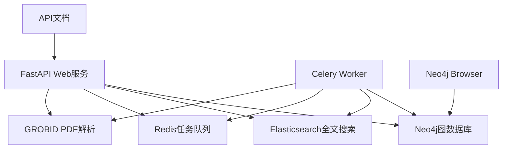

# Literature Parser Backend - Neo4j版本

🚀 **基于Neo4j图数据库的智能文献解析与管理系统**

## 🎯 核心特性

- **📊 图数据库驱动** - 原生支持文献引用关系查询
- **🔍 全文搜索** - Elasticsearch支持的高级搜索功能  
- **⚡ 高性能查询** - Neo4j原生图遍历，支持复杂关系分析
- **🔄 异步处理** - Celery任务队列处理耗时操作
- **📈 可视化探索** - Neo4j Browser支持交互式数据探索

## 🏗️ 系统架构



## 🚀 快速启动

### 一键启动
```bash
# 克隆项目并进入目录
cd /path/to/Paper_Paser_1

# 运行启动脚本
./start_neo4j.sh
```

### 手动启动
```bash
# 1. 启动所有服务
docker-compose up -d

# 2. 检查服务状态
docker-compose ps

# 3. 查看日志
docker-compose logs -f
```

## 📊 服务访问

| 服务 | 地址 | 用途 | 认证 |
|------|------|------|------|
| **Neo4j Browser** | http://localhost:7474 | 图数据库管理 | neo4j / literature_parser_neo4j |
| **API服务** | http://localhost:8000 | REST API接口 | 无需认证 |
| **API文档** | http://localhost:8000/api/docs | 交互式API文档 | 无需认证 |
| **Elasticsearch** | http://localhost:9200 | 搜索引擎 | elastic / literature_parser_elastic |
| **Redis Commander** | http://localhost:8081 | Redis管理 | 无需认证 |

## 🔍 Neo4j图查询示例

### 基础查询
```cypher
// 查看数据概览
MATCH (n) RETURN labels(n) as label, count(n) as count

// 查看所有文献
MATCH (lit:Literature) RETURN lit LIMIT 10

// 查看别名映射
MATCH (alias:Alias)-[:IDENTIFIES]->(lit:Literature) 
RETURN alias.alias_type, alias.alias_value, lit.lid LIMIT 10
```

### 引用关系查询 (Phase 2功能)
```cypher
// 查看引用关系
MATCH (a:Literature)-[:CITES]->(b:Literature) 
RETURN a.metadata.title, b.metadata.title LIMIT 5

// 查找高被引文献
MATCH (lit:Literature)<-[:CITES]-(citing)
RETURN lit.metadata.title, count(citing) as citation_count
ORDER BY citation_count DESC LIMIT 10

// 查找两篇文献间的引用路径
MATCH path = shortestPath(
  (a:Literature {lid: "2017-vaswani-aiaynu-a8c4"})-[:CITES*]->(b:Literature {lid: "2014-sutskever-snmtbg-a1b2"})
)
RETURN path
```

## 📝 API使用示例

### 提交文献解析
```bash
# 通过DOI提交
curl -X POST "http://localhost:8000/api/literature" \
  -H "Content-Type: application/json" \
  -d '{
    "source": {
      "doi": "10.48550/arXiv.1706.03762"
    }
  }'

# 通过URL提交
curl -X POST "http://localhost:8000/api/literature" \
  -H "Content-Type: application/json" \
  -d '{
    "source": {
      "url": "https://arxiv.org/abs/1706.03762"
    }
  }'
```

### 查询任务状态
```bash
curl "http://localhost:8000/api/task/{task_id}"
```

### 获取文献数据
```bash
curl "http://localhost:8000/api/literature/{literature_id}"
```

## 🛠️ 开发指南

### 项目结构
```
literature_parser_backend/
├── db/
│   ├── neo4j.py              # Neo4j连接管理
│   ├── dao.py                # 文献数据访问对象  
│   ├── alias_dao.py          # 别名映射DAO
│   └── relationship_dao.py   # 关系管理DAO
├── models/                   # Pydantic数据模型
├── web/api/                  # FastAPI路由
├── worker/                   # Celery任务处理
└── services/                 # 业务服务层
```

### 数据模型映射

| MongoDB集合 | Neo4j对应 | 说明 |
|-------------|-----------|------|
| `literatures` | `:Literature`节点 | 文献主体数据 |
| `aliases` | `:Alias`节点 + `:IDENTIFIES`关系 | 标识符映射 |
| `literature_relationships` | `:CITES`关系 | 引用关系 |

### 添加新功能
1. **数据模型** - 在`models/`中定义Pydantic模型
2. **数据访问** - 在相应DAO中添加方法
3. **API端点** - 在`web/api/`中添加路由
4. **业务逻辑** - 在`services/`中实现服务

## 🔧 运维指南

### 日志查看
```bash
# 查看所有服务日志
docker-compose logs -f

# 查看特定服务日志
docker-compose logs -f neo4j
docker-compose logs -f api
docker-compose logs -f worker
```

### 数据备份
```bash
# Neo4j数据导出
docker-compose exec neo4j neo4j-admin database dump neo4j

# Elasticsearch索引备份
curl -X PUT "localhost:9200/_snapshot/my_backup"
```

### 性能监控
```bash
# Neo4j性能监控
# 访问 http://localhost:7474 -> 在Browser中运行:
CALL dbms.queryJmx("org.neo4j:instance=kernel#0,name=Transactions") 
YIELD attributes
RETURN attributes.NumberOfOpenTransactions
```

## 📚 Phase 2 功能预览

当前系统为Phase 1（功能对等替换），未来Phase 2将提供：

- 🔗 **悬空引用自动解析** - 智能匹配未解析的引用
- 📊 **图分析算法** - PageRank、社区检测、影响力分析
- 🌐 **引用网络可视化** - 交互式图谱展示
- 🔍 **高级图查询API** - 复杂关系查询接口

## ❓ 常见问题

### Neo4j连接失败
```bash
# 检查服务状态
docker-compose ps

# 查看Neo4j日志
docker-compose logs neo4j

# 重启Neo4j
docker-compose restart neo4j
```

### 内存不足
```bash
# 调整Neo4j内存配置（编辑docker-compose.yml）
environment:
  - NEO4J_dbms_memory_heap_max__size=4G
  - NEO4J_dbms_memory_pagecache_size=2G
```

### 数据清理
```bash
# 清理所有数据（危险操作！）
docker-compose down -v

# 只清理Neo4j数据
docker volume rm $(docker volume ls -q | grep neo4j)
```

## 🤝 贡献指南

1. Fork项目
2. 创建功能分支 (`git checkout -b feature/amazing-feature`)
3. 提交更改 (`git commit -m 'Add amazing feature'`)
4. 推送分支 (`git push origin feature/amazing-feature`)
5. 创建Pull Request

## 📄 许可证

本项目基于MIT许可证 - 查看[LICENSE](LICENSE)文件了解详情。

---

**🎉 恭喜！您现在拥有了基于Neo4j的强大图数据库文献管理系统！**
