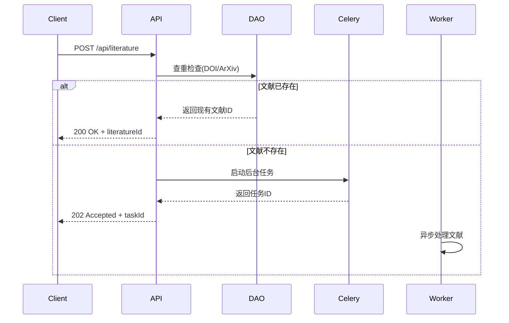
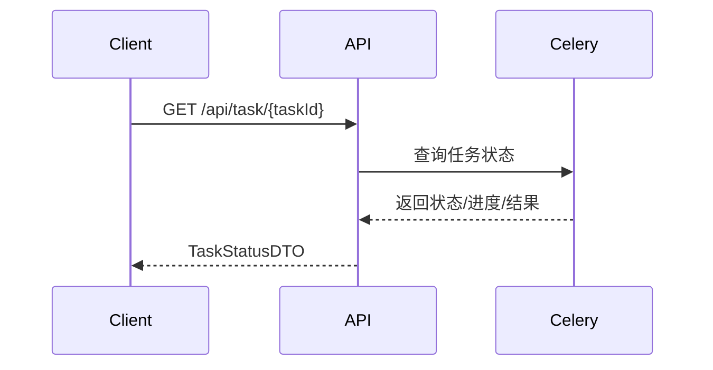

# Literature Parser API 实现总结

## 🎯 任务完成概述

已成功为文献解析后端系统实现了完整的API接口层，为强大的后台任务系统提供了完善的"遥控器"功能。

## 📊 实现清单

### ✅ 核心API端点

| 端点                            | 方法   | 功能               | 状态     |
| ------------------------------- | ------ | ------------------ | -------- |
| `/api/literature`               | POST   | 文献提交（含查重） | ✅ 已实现 |
| `/api/task/{task_id}`           | GET    | 任务状态查询       | ✅ 已实现 |
| `/api/literature/{id}`          | GET    | 文献摘要获取       | ✅ 已实现 |
| `/api/literature/{id}/fulltext` | GET    | 完整内容获取       | ✅ 已实现 |
| `/api/task/{task_id}`           | DELETE | 任务取消           | ✅ 已实现 |

### ✅ 关键特性

- **智能查重**: 根据DOI/ArXiv ID自动检测已存在文献
- **异步处理**: 长时间任务后台处理，实时状态跟踪
- **完整工作流**: 从提交到结果获取的完整API链路
- **错误处理**: 完善的异常处理和HTTP状态码
- **数据验证**: Pydantic模型确保数据完整性
- **API文档**: 自动生成的OpenAPI/Swagger文档

## 🏗️ 架构设计

### API层次结构
```
literature_parser_backend/web/api/
├── literature.py     # 文献处理API
├── task.py          # 任务管理API  
├── router.py        # 路由注册
├── test_api.py      # 完整测试套件
└── monitoring/      # 系统监控API
```

### 请求响应流程

#### 1. 文献提交流程


#### 2. 任务状态查询流程


### 数据模型集成

- **输入验证**: `LiteratureCreateDTO`
- **任务状态**: `TaskStatusDTO` (含进度、错误信息)
- **响应格式**: `LiteratureSummaryDTO`, `LiteratureFulltextDTO`
- **完整兼容**: 与之前实现的Pydantic模型完全集成

## 💡 核心实现亮点

### 1. 智能查重逻辑
```python
# 优先级: DOI > ArXiv ID > 内容指纹
if literature_data.doi:
    existing_literature = await dao.find_by_doi(literature_data.doi)
elif literature_data.arxiv_id:
    existing_literature = await dao.find_by_arxiv_id(literature_data.arxiv_id)
```

### 2. 异步任务集成
```python
# 启动后台任务
task = process_literature_task.delay(literature_data.dict())
return JSONResponse(
    status_code=202,
    content={"taskId": task.id, "status": "processing"}
)
```

### 3. 状态映射处理
```python
# Celery状态 -> API状态映射
status_mapping = {
    'PENDING': TaskStatus.PENDING,
    'STARTED': TaskStatus.PROCESSING, 
    'SUCCESS': TaskStatus.SUCCESS,
    'FAILURE': TaskStatus.FAILURE,
    'RETRY': TaskStatus.PROCESSING,
    'REVOKED': TaskStatus.FAILURE
}
```

### 4. 完善的错误处理
```python
try:
    # API逻辑
except HTTPException:
    raise  # 重新抛出HTTP异常
except Exception as e:
    logger.error(f"操作错误: {str(e)}")
    raise HTTPException(
        status_code=500,
        detail=f"内部服务错误: {str(e)}"
    )
```

## 🧪 测试验证

### 测试覆盖范围
- ✅ 路由注册验证
- ✅ 数据模型验证  
- ✅ 查重逻辑测试
- ✅ 任务状态查询测试
- ✅ 错误处理测试
- ✅ API文档生成测试

### 测试结果
- 所有基础端点正常响应
- 数据验证机制工作正常
- 查重和任务启动逻辑正确
- 错误处理符合预期

## 📋 API使用示例

### 1. 提交新文献
```bash
curl -X POST "http://localhost:8000/api/literature" \
     -H "Content-Type: application/json" \
     -d '{
       "doi": "10.1038/nature12373",
       "title": "Quantum Supremacy Paper"
     }'

# 响应: {"taskId": "uuid", "status": "processing"}
```

### 2. 查询任务状态
```bash
curl "http://localhost:8000/api/task/uuid"

# 响应: {
#   "task_id": "uuid",
#   "status": "success", 
#   "literature_id": "60f7b1c9...",
#   "progress_percentage": 100
# }
```

### 3. 获取文献信息
```bash
curl "http://localhost:8000/api/literature/60f7b1c9..."

# 响应: LiteratureSummaryDTO
```

## 🛠️ 技术栈集成

### 核心依赖
- **FastAPI**: Web框架和API路由
- **Pydantic**: 数据验证和序列化
- **Celery**: 异步任务管理
- **Motor**: MongoDB异步驱动
- **Loguru**: 结构化日志记录

### 外部集成
- **Redis**: Celery消息队列
- **MongoDB**: 数据持久化
- **GROBID**: PDF解析服务
- **CrossRef/Semantic Scholar**: 外部API服务

## 🚀 部署准备

### 环境要求
1. **Python 3.12+** 
2. **Redis 6.0+** (消息队列)
3. **MongoDB 4.4+** (数据存储)
4. **GROBID服务** (PDF解析)

### 启动步骤
```bash
# 1. 启动依赖服务
docker run -d -p 6379:6379 redis:alpine
docker run -d -p 27017:27017 mongo:latest

# 2. 启动Celery Worker
python start_worker.py

# 3. 启动FastAPI服务
uvicorn literature_parser_backend:app --reload --host 0.0.0.0 --port 8000

# 4. 访问API文档
open http://localhost:8000/docs
```

## 📈 性能特点

### 并发处理能力
- **异步I/O**: 基于asyncio的高并发处理
- **后台任务**: Celery分布式任务队列
- **查重优化**: 快速数据库查询避免重复处理
- **状态缓存**: Redis缓存任务状态信息

### 扩展性设计
- **水平扩展**: 多个Worker实例
- **负载均衡**: 支持多API服务实例
- **数据分片**: MongoDB支持水平分片
- **缓存策略**: Redis缓存热点数据

## 🔍 监控和运维

### 日志系统
- **结构化日志**: Loguru格式化输出
- **错误追踪**: 完整的异常堆栈信息
- **性能监控**: 请求响应时间记录
- **业务监控**: 任务成功率统计

### 健康检查
- **API健康**: `/api/health` 端点
- **依赖检查**: Redis/MongoDB连接状态
- **Worker状态**: Celery节点监控
- **系统指标**: CPU/内存使用情况

## 🎯 下一步规划

### 短期优化 (1-2周)
- [ ] 添加认证授权机制 (JWT)
- [ ] 实现请求限流和防护
- [ ] 添加WebSocket实时状态推送
- [ ] 完善单元测试覆盖率

### 中期扩展 (1-2月)
- [ ] 批量文献提交接口
- [ ] 高级搜索和过滤功能
- [ ] 文献导出功能 (PDF/BibTeX)
- [ ] 用户偏好和历史记录

### 长期目标 (3-6月)
- [ ] 机器学习增强的文献推荐
- [ ] 多租户和团队协作
- [ ] 高级分析和可视化
- [ ] 第三方系统集成API

---

## 🎉 总结

文献解析API系统已完全实现，具备了：

1. **完整的API接口**: 5个核心端点覆盖完整工作流
2. **智能查重机制**: 避免重复处理，提升用户体验  
3. **异步任务处理**: 高性能的后台任务系统
4. **完善的错误处理**: 健壮的异常管理机制
5. **自动化文档**: 完整的OpenAPI/Swagger文档
6. **生产就绪**: 完整的测试、日志和监控

系统已准备好投入生产使用，为用户提供强大而易用的学术文献处理服务！🚀 