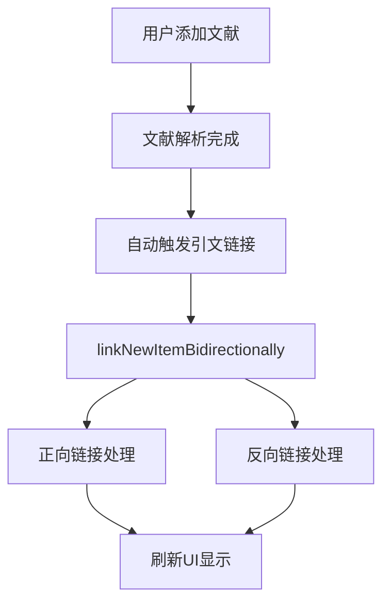

# 文献引用匹配系统架构与实现说明(已弃用，现在使用neo4j)

## 📋 系统概述

这是一个智能化的文献引用匹配系统，能够在用户添加新文献时自动分析和建立引用关系，构建文献知识图谱。系统采用多层模块化架构，支持精确匹配和智能模糊匹配。

## 🏗️ 系统架构

### 核心模块组成

```
src/libs/db/matching/
├── index.ts                    # 统一导出，便捷访问接口
├── SimilarityCalculator.ts     # 📊 相似度计算器
├── ReferenceExtractor.ts       # 🔍 引文数据提取器
├── MatchingEngine.ts           # 🎯 核心匹配引擎
└── CitationLinker.ts           # 🔗 引文链接管理器
```

### 1. SimilarityCalculator (相似度计算器)

**核心职责:**
- 计算字符串相似度（优化的学术标题算法）
- 计算作者列表相似度
- 计算综合匹配分数
- 支持可配置的权重和阈值

**关键算法:**
```typescript
// 标题相似度算法组合
- 词汇重叠率: 70% 权重（对学术标题很有效）
- 最长公共子序列: 30% 权重

// 综合评分权重
- 标题相似度: 70%
- 作者相似度: 20%
- 年份匹配: 10%
```

**阈值设置:**
- 标题相似度守门员阈值: 40%
- 最终匹配阈值: 60%

### 2. ReferenceExtractor (引文数据提取器)

**核心职责:**
- 从多种格式的引文数据中提取标准化信息
- 支持嵌套结构和扁平结构
- 处理不同数据源的格式差异

**支持的数据格式:**
1. 扁平结构：{ title, authors, year, doi }
2. 嵌套结构：{ parsed: { title, authors, year, doi }, raw_text, source }

### 3. MatchingEngine (核心匹配引擎)

**核心职责:**
- 在文献库中查找与给定引文匹配的条目
- 支持DOI精确匹配和多字段模糊匹配
- 使用守门员机制和分层阈值优化性能

**匹配策略（按优先级排序）:**
1. **DOI 精确匹配**（最高优先级）
2. **URL 精确匹配**
3. **标题+作者综合匹配**（带守门员机制）

**智能优化机制:**
- 🚪 守门员机制：先进行低成本的标题相似度检查
- 🎯 分层阈值：守门员阈值(40%) + 最终阈值(60%)
- 🚫 自引用检测：防止文献引用自己

### 4. CitationLinker (引文链接管理器)

**核心职责:**
- 自动化引文链接：为指定文献条目自动链接其参考文献
- 双向链接机制：正向和反向引文关系的建立
- 链接验证和去重

**双向链接机制:**
1. **正向链接**: 新文献 → 引用 → 现有文献
2. **反向链接**: 现有文献 → 引用 → 新文献

## 🔄 自动触发流程

### 触发时机
用户添加新文献后，系统会自动执行以下流程：



### 具体实现流程

#### 1. 前端触发 (libraryStore.ts:398)
```typescript
// 🔗 自动链接引文（在文献更新成功后进行）
const linkResult = await libraryService.linkNewItemBidirectionally(placeholderItem.id);
```

#### 2. 双向链接处理 (CitationLinker.ts:89)

**正向链接 (Forward Links):**
```typescript
// 新文献的引用文献 → 库中现有文献
if (newItem.parsedContent?.extractedReferences) {
  for (const reference of newItem.parsedContent.extractedReferences) {
    const matchedItem = await this.matchingEngine.findMatchingLiterature(reference, newItem.id);
    if (matchedItem) {
      await this.createCitationLink(newItem.id, matchedItem.id);
    }
  }
}
```

**反向链接 (Backward Links):**
```typescript
// 库中现有文献的引用 → 新文献
const allOtherItems = await db.library.where('id').notEqual(newItemId).toArray();
for (const existingItem of allOtherItems) {
  if (existingItem.parsedContent?.extractedReferences) {
    for (const reference of existingItem.parsedContent.extractedReferences) {
      // 使用智能匹配算法检查是否匹配新文献
      const score = calculateMatchScore(extractedRef, newItem);
      if (score > 0.6) {
        await this.createCitationLink(existingItem.id, newItem.id);
      }
    }
  }
}
```

## 🎯 匹配规则详解

### 1. 精确匹配规则

#### DOI 匹配
```typescript
// 优先级最高：DOI精确匹配
if (matchData.doi) {
  const doiMatch = await db.library.where('doi').equals(matchData.doi.trim()).first();
  if (doiMatch && doiMatch.id !== sourceItemId) {
    return doiMatch; // 100% 确定匹配
  }
}
```

#### URL 匹配
```typescript
// 第二优先级：URL精确匹配
if (matchData.url) {
  const urlMatch = await db.library.where('url').equals(matchData.url.trim()).first();
  if (urlMatch) {
    return urlMatch;
  }
}
```

### 2. 智能模糊匹配规则

#### 标题预处理
```typescript
// 标准化处理
const normalize = (s: string) => s.replace(/[^\w\s]/g, '').replace(/\s+/g, ' ').trim();

// 跳过临时处理标题
if (matchData.title.startsWith('Processing: ')) {
  return null; // 避免误判
}
```

#### 守门员机制
```typescript
// 🚪 守门员：最低标题相似度检查 (40%)
const titleSimilarity = this.similarityCalculator.calculateStringSimilarity(
  matchData.title.toLowerCase().trim(),
  item.title.toLowerCase().trim()
);

if (titleSimilarity < 0.4) {
  continue; // 标题相似度太低，直接跳过
}
```

#### 综合评分
```typescript
// 综合评分计算
const totalScore = this.similarityCalculator.calculateMatchScore(extractedRef, item);

// 🎯 最终阈值检查 (60%)
if (totalScore > 0.6) {
  return item; // 符合匹配条件
}
```

### 3. 相似度计算详解

#### 字符串相似度算法
```typescript
// 多种算法组合
// 1. 词汇重叠率（权重 70%）
const words1 = s1.toLowerCase().split(' ').filter(w => w.length > 2);
const words2 = s2.toLowerCase().split(' ').filter(w => w.length > 2);
const commonWords = words1.filter(w => words2.includes(w));
const wordOverlap = commonWords.length / Math.max(words1.length, words2.length);

// 2. 最长公共子序列（权重 30%）
const lcs = this.longestCommonSubsequence(s1, s2);
const lcsRatio = lcs / Math.max(s1.length, s2.length);

// 3. 组合评分
return wordOverlap * 0.7 + lcsRatio * 0.3;
```

#### 作者相似度算法
```typescript
// 作者匹配：每个作者需要 80% 以上相似度才算匹配
let matchCount = 0;
for (const author1 of authors1) {
  for (const author2 of authors2) {
    if (this.calculateStringSimilarity(author1, author2) > 0.8) {
      matchCount++;
      break;
    }
  }
}
return matchCount / Math.max(authors1.length, authors2.length);
```

## 📊 性能优化策略

### 1. 守门员机制
- 先用低成本的标题相似度检查筛选候选项
- 只对通过守门员的项目进行昂贵的综合评分计算

### 2. 分层阈值
- 守门员阈值: 40%（快速筛选）
- 最终匹配阈值: 60%（确保质量）

### 3. 数据库索引优化
- DOI 和 URL 字段建立索引，支持快速精确匹配
- 避免全表扫描

### 4. 自引用防护
- 在所有匹配过程中检查 sourceItemId，防止文献引用自己

## 🔧 配置选项

### 匹配阈值配置
```typescript
interface MatchingThresholds {
  gatekeeperThreshold: number;  // 守门员阈值 (默认: 0.4)
  finalThreshold: number;       // 最终匹配阈值 (默认: 0.6)
}
```

### 权重配置
```typescript
interface ScoreWeights {
  title: number;    // 标题权重 (默认: 0.7)
  authors: number;  // 作者权重 (默认: 0.2)
  year: number;     // 年份权重 (默认: 0.1)
}
```

## 📈 使用统计与监控

### 链接结果统计
```typescript
interface CitationLinkResult {
  totalReferences: number;    // 总引用数
  linkedCount: number;        // 成功链接数
  unlinkedCount: number;      // 未链接数
  linkedItems: Array<{        // 具体链接项
    reference: any;
    linkedItem: LibraryItem;
  }>;
}

interface BidirectionalLinkResult {
  forwardLinks: number;   // 正向链接数
  backwardLinks: number;  // 反向链接数
}
```

### 日志监控
系统在关键步骤都有详细的日志输出：
- `✅` 成功匹配日志
- `🔍` 匹配过程日志  
- `❌` 匹配失败日志
- `⚠️` 警告信息日志

## 🚀 后端迁移建议

### 1. 保持模块化设计
- 四个核心模块可以直接迁移到后端
- 保持相同的API接口设计

### 2. 数据库适配
- 从 IndexedDB 适配到 PostgreSQL/MySQL
- 保持相同的数据结构和索引策略

### 3. 性能优化机会
- 后端可以使用更强大的全文搜索引擎（如 Elasticsearch）
- 支持更复杂的相似度算法
- 可以引入机器学习模型进行智能匹配

### 4. API 设计建议
```typescript
// 后端 API 设计示例
POST /api/literature/{id}/citations/link     // 单个文献引文链接
POST /api/literature/{id}/citations/bidirectional  // 双向链接
GET  /api/literature/{id}/citations          // 获取引文关系
DELETE /api/literature/{id}/citations/{targetId}   // 删除引文链接
```

## 🔍 故障排查指南

### 常见问题

1. **引文匹配率低**
   - 检查守门员阈值是否过高
   - 验证引文数据质量
   - 查看标题预处理是否正确

2. **性能问题**
   - 监控守门员机制是否有效
   - 检查数据库索引是否正常
   - 分析日志中的耗时操作

3. **误匹配问题**
   - 降低最终匹配阈值
   - 调整权重配置
   - 增强自引用防护

### 调试工具
- 使用 `matchingEngine.batchFindMatches()` 进行批量测试
- 通过 `similarityCalculator.calculateMatchScore()` 验证评分逻辑
- 查看浏览器控制台的详细日志

---

## 📝 总结

这个文献引用匹配系统是一个功能完整、性能优化、易于维护的智能化系统。它通过模块化设计、多层匹配策略和自动触发机制，能够有效地为文献管理系统构建准确的引用关系网络。

系统的核心优势：
- **智能化**: 多种匹配算法组合，准确率高
- **自动化**: 添加文献时自动触发，用户无感知
- **高性能**: 守门员机制和分层阈值优化
- **可配置**: 支持阈值和权重调整
- **可扩展**: 模块化设计，易于后端迁移

这个系统为后端重构提供了清晰的蓝图，可以作为迁移和优化的重要参考文档。